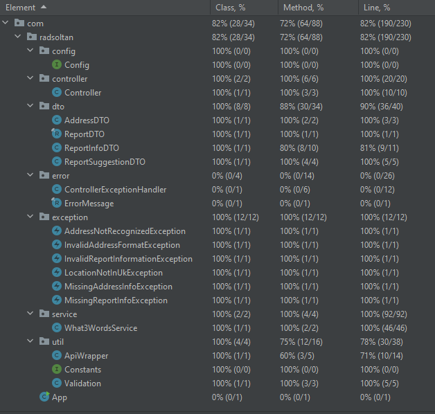

# what3words-techtask

An emergency service is looking to build a restful API for emergency reporting. One
of the desired features of this is to use the w3w API for converting coordinates into
three word addresses and converting three word addresses into coordinates.
As technical requirements they want to use Java and Spring Boot to do this.
You can find the API reference for the what3words API here:

https://developer.what3words.com/public-api/docs#overview

There is also a Java wrapper which you can use here:

https://developer.what3words.com/tutorial/java

The what3words APIs require an API key, this can be created at:

https://developer.what3words.com/public-api

API endpoints: The API will need to receive and respond in JSON.

### Emergency Report Endpoint

An endpoint that takes the report information, validates it and fills in the missing
information.

#### Validation

- The endpoint should implement the POST method, and accept either latitude (lat) +
longitude (lng) or 3 word address (3wa) or both as JSON, as per the below.

- If the lat, lng aren't present use the w3w API to get this. If the 3wa isn't present use
the lat, lng to get this. If none are present return an error.

- Also if a 3wa is supplied but it is not a valid 3wa return an error. This page may be
useful for this:
https://developer.what3words.com/tutorial/detecting-if-text-is-in-the-format-of-a-3-word-address

- This emergency service is also based in the UK so the API should not accept
addresses from outside the UK. If the lat, lng somehow don't return a 3wa when trying to convert return an error
- If a 3wa is provided but doesn't meet the validation criteria, try using
https://developer.what3words.com/public-api/docs#autosuggest if this does return
results, return 3 suggestions in the error response
- **NOTE from Rad: I also added a case to throw an error if both 3wa and lat + lng are provided, but they don't correspond to the same place on Earth.**

#### Examples

Request: `localhost:8080/emergencyapi/reports`

```
{
    "message":"A hiker has got lost",
    "lat": null,
    "lng":null,
    "3wa": "daring.lion.race",
    "reportingOfficerName": "Joe Bloggs"
}
```
or 
```
{
    "message":"A hiker has got lost",
    "lat": 51.508341,
    "lng":-0.125499,
    "3wa": null,
    "reportingOfficerName": "Joe Bloggs"
}
```
Response:
```
{
    "message":"A hiker has got lost",
    "lat": 51.508341,
    "lng":-0.125499,
    "3wa": "daring.lion.race",
    "reportingOfficerName": "Joe Bloggs"
}
```
Error responses:
```
{
    "message":"3wa address supplied has invalid format"
}
```
```
{

    "message":"3wa not recognised: filled.count.snap",
    "suggestions": [
        {
            "country": "GB",
            "nearestPlace": "Bayswater, London",
            "words": "filled.count.soap"
        },
        {
            "country": "GB",
            "nearestPlace": "Wednesfield, W. Midlands",
            "words": "filled.count.slap"
        },
        {
            "country": "GB",
            "nearestPlace": "Orsett, Thurrock",
            "words": "fills.count.slap"
        }
    ]
}
```
### Convert English W3A to Welsh Endpoint

An endpoint that returns the equivalent Welsh 3wa to a location when submitted to in
English. The endpoint should implement the POST method, and accept a 3wa as JSON, as
per the below.

#### Validation

Similar validation as above, try and make sure the 3wa is of a valid format and is
within the bounds of the UK.

Request: `localhost:8080/emergencyapi/welsh-convert`

```
{
    "3wa": "daring.lion.race"
}
```
Response: 
```
{
    "3wa": "sychach.parciau.lwmpyn"
}
```
### Convert Welsh W3A to Welsh

Similar to the previous endpoint but vice versa.

Request: `localhost:8080/emergencyapi/welsh-3wa`

```
{
    "3wa": "sychach.parciau.lwmpyn"
}
```
Response:
```
{
    "3wa": "daring.lion.race"
}
```
### API Key:

To configure the API paste the API key to:

`src/main/java/com/radsoltan/config/Config.java`

### Unit Test Coverage:

